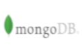

# Objetivo 

Quando criei o projeto, pensei em como seria interessante avaliar os casos de Covid-19 por região, e portanto, saber quais lugares evitar ou quais lugares os esforços deveriam ser concentrados. Enfim, pra alguem que nunca tinha trabalhado com muitas das tecnologias que eu trabalhei nesse projeto, demorou um pouco para as coisas irem tomando forma. Mas tomaram! 


##### _PS:  Ainda tenho muito o que trabalhar aqui._

---

# Detalhes do Projeto


### MongoDB


Como database utilizei um MongoDB. 
No link a seguir você pode criar uma conta gratuita, direto na cloud. Vale a pena dar uma olhada!!
<https://account.mongodb.com/account/register?n=%2Fv2%2F6076f12d4ad5554a08508044&nextHash=%23clusters>

Lembrando que sem uma string de conexão, não tem jeito de salvar as informações das pessoas cadastradas 😁


### API Google Maps 


A utilização da API do Google Maps segue a mesma ideia do MongoDB. Você pode criar uma conta gratuita no Google Cloud Plataform (link abaixo). 

<https://cloud.google.com/>

Dessa vez, pra utilizar a API do Google Maps você vai precisar de uma API Key. É bem simples, mas sem ela, nada de mapinha. Link 👇
<https://developers.google.com/maps/documentation/javascript/get-api-key>


##
Os dois ajustes devem ser feitos no arquivos appsettings.json, nos campos _DefaultConnection_ e _ApiKey_

```
{
  "Logging": {
    "LogLevel": {
      "Default": "Information",
      "Microsoft": "Information",
      "Microsoft.Hosting.Lifetime": "Information"
    }
  },
  "AllowedHosts": "*",
  "ConnectionString": {
    "DefaultConnection": ""
  },
  "NomeBanco": "MapeamentoCovid",
  "ApiKey": ""
}
```
